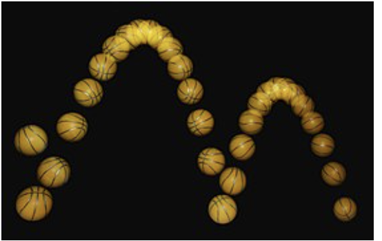

# 23_11_BouncingBalls_Medium

  

[Wikipedia](https://en.wikipedia.org/wiki/Bouncing_ball)

## **🔗 Links**
- [**Return Home**](Home)
- [**Return to Oral Exam 2**](https://class-git.engineering.uiowa.edu/swd2024fall/mnkrueger/-/wikis/Landing-Page/Oral-Exam-2)

## **💻 Source Code**
- [21_11_BouncingBalls_Medium](https://class-git.engineering.uiowa.edu/swd2024fall/mnkrueger/-/tree/master/oral_exam2/23_11_BouncingBalls_Medium?ref_type=heads)
 
## **🗨️ Problem Statement** 
Create a **Java Swing** program that models a maximum of 100 bouncing balls on the screen. A **user click** should add additional bouncing balls to the screen. When the ball hits an edge, it should continue in the opposite direction.
 
## **🎮 User Documentation**
Once the program has started, the user will be shown a blank, white screen. This is the JPanel that holds the bouncing balls created by the user.

  

Directions:
1. Left Click: Add new ball to screen
2. Right Click: Remove most recent ball
3. No more than 100 balls can be on screen, and no fewer than 0

A **left click**_ of the mouse (single-finger click on mouse track) will _create a new ball_ and add it to Executor service, which is set to execute by a timer in the panel's thread.

A **right click** of the mouse will _remove the most recently added ball_, and it will no longer be updated and painted in the EDT.

Here is what the program looks like with the balls:

  

## **✏️ Developer Documentation**
**Entry Point:**
- [Main.java](https://class-git.engineering.uiowa.edu/swd2024fall/mnkrueger/-/blob/master/oral_exam2/23_11_BouncingBalls_Medium/src/Main.java?ref_type=heads)

**Packages:**
- [src](https://class-git.engineering.uiowa.edu/swd2024fall/mnkrueger/-/tree/master/oral_exam2/23_11_BouncingBalls_Medium/src?ref_type=heads): contains classes for gui components, mouse listener, and ball objects. Includes [BouncingBallFrame](https://class-git.engineering.uiowa.edu/swd2024fall/mnkrueger/-/blob/master/oral_exam2/23_11_BouncingBalls_Medium/src/BouncingBallFrame.java?ref_type=heads), [BouncingBallPanel](https://class-git.engineering.uiowa.edu/swd2024fall/mnkrueger/-/blob/master/oral_exam2/23_11_BouncingBalls_Medium/src/BouncingBallPanel.java?ref_type=heads), [BouncingBallMouseHandler](https://class-git.engineering.uiowa.edu/swd2024fall/mnkrueger/-/blob/master/oral_exam2/23_11_BouncingBalls_Medium/src/BouncingBallMouseHandler.java?ref_type=heads), and [BouncingBall](https://class-git.engineering.uiowa.edu/swd2024fall/mnkrueger/-/blob/master/oral_exam2/23_11_BouncingBalls_Medium/src/BouncingBall.java?ref_type=heads). [Main.java](https://class-git.engineering.uiowa.edu/swd2024fall/mnkrueger/-/blob/master/oral_exam2/23_11_BouncingBalls_Medium/src/Main.java?ref_type=heads) is also included inside of this package.

**Classes (in more depth as there is only the single package):**
- [BouncingBallFrame](https://class-git.engineering.uiowa.edu/swd2024fall/mnkrueger/-/blob/master/oral_exam2/23_11_BouncingBalls_Medium/src/BouncingBallFrame.java?ref_type=heads): Parent frame for java swing application. No threads, simply holds the bouncing ball panel
- [BouncingBallPanel](https://class-git.engineering.uiowa.edu/swd2024fall/mnkrueger/-/blob/master/oral_exam2/23_11_BouncingBalls_Medium/src/BouncingBallPanel.java?ref_type=heads): java swing jpanel to hold the bouncing balls. This runs on its own thread, which continuously repaints the screen by using a swing timer pointing to repaint(). 
- [BouncingBallMouseHandler](https://class-git.engineering.uiowa.edu/swd2024fall/mnkrueger/-/blob/master/oral_exam2/23_11_BouncingBalls_Medium/src/BouncingBallMouseHandler.java?ref_type=heads): handles user interaction with mouse. Only implemented method is mousePressed(...).
- [BouncingBall](https://class-git.engineering.uiowa.edu/swd2024fall/mnkrueger/-/blob/master/oral_exam2/23_11_BouncingBalls_Medium/src/BouncingBall.java?ref_type=heads): single threaded class that handles the painting of a java swing oval, thread calculates the new position so that all balls move at the same time (concurrently rather than sequentially).

**Documentation:**
- https://class-git.engineering.uiowa.edu/swd2024fall/mnkrueger/-/tree/master/oral_exam2/23_11_BouncingBalls_Medium/doc?ref_type=heads

## 🖼️ UML Diagram

  

## ⚠️ Important Note!

The projects contained inside this repository are Java projects. Please be aware that I did not include any configuration files that could be easily ported to IDEs such as IntelliJ. You will need to set up your own project configuration if you wish to import these projects into an IDE.
 
Additionally, many of the links may point to gitlab pages - which you will likely not be able to access.

