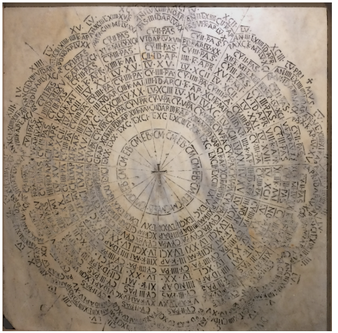

# S1_Computus_Hard

  

[Wikipedia](https://en.wikipedia.org/wiki/Date_of_Easter)

## **🔗 Links**
- [**Return Home**](Home)
- [**Return to Oral Exam 2**](https://class-git.engineering.uiowa.edu/swd2024fall/mnkrueger/-/wikis/Landing-Page/Oral-Exam-2)

## **💻 Source Code**
- [**S1_Computus_Hard**](https://class-git.engineering.uiowa.edu/swd2024fall/mnkrueger/-/tree/master/oral_exam2/S1_Computus_Hard?ref_type=heads)

## **🗨️ Problem Statement**
Write a Java program to calculate the month and day of Easter in the Gregorian calendar **without using Java libraries**. Complete the **Meeus/Jones/Butcher Gregorian algorithm**, give the dates for the next 5,700,000 years, and write **JUnit code to test the output** & validity of the program. 

## :page_with_curl: **Algorithms** (via Wikipedia)
_Included in this program are two algorithms to obtain the date of Easter:_

**1. Gregorian Calendar Easter (Meeus/Jones/Butcher algorithm)**

  

**2. Julian Calendar Easter (Meeus' Julian algorithm)**

  

_There is also Guass' Easter Algorithm, which can calculate both the Julian and Gregorian Easters. I did not code this algorithm._

## **🎮 User Documentation**
Upon starting the program, the user will be presented a CLI message asking for an action:

  

Available actions:
1. **Compute Gregorian Easter for Specified Date:** Gives the Gregorian Easter date for a user specified year.
2. **Compute Julian Easter for Specified Date:** Gives the Julian Easter date for a user specified year.
3. **EXIT PROGRAM:** Terminates the program.

## **✏️ Developer Documentation**
**Entry Point:** 
- [**S1_Computus_Hard/src/Main.java**](https://class-git.engineering.uiowa.edu/swd2024fall/mnkrueger/-/blob/master/oral_exam2/S1_Computus_Hard/src/Main.java?ref_type=heads) Manage user input & program loop. Also updates [**Month**](https://class-git.engineering.uiowa.edu/swd2024fall/mnkrueger/-/blob/master/oral_exam2/S1_Computus_Hard/src/utils/Month.java?ref_type=heads) count arrays to obtain Easter cycle date counts.

**Packages:** 
- [**S1_Computus_Hard/src/easter**/:](https://class-git.engineering.uiowa.edu/swd2024fall/mnkrueger/-/tree/master/oral_exam2/S1_Computus_Hard/src/easter?ref_type=heads) Contains classes for algorithms Computus algorithms. Includes [**Easter:**](https://class-git.engineering.uiowa.edu/swd2024fall/mnkrueger/-/blob/master/oral_exam2/S1_Computus_Hard/src/easter/Easter.java?ref_type=heads) (base class), [**GregorianEaster**](https://class-git.engineering.uiowa.edu/swd2024fall/mnkrueger/-/blob/master/oral_exam2/S1_Computus_Hard/src/easter/GregorianEaster.java?ref_type=heads) (Gregorian Calendar), and [**JulianEaster**](https://class-git.engineering.uiowa.edu/swd2024fall/mnkrueger/-/blob/master/oral_exam2/S1_Computus_Hard/src/easter/JulianEaster.java?ref_type=heads) (Julian Calendar).
- [**S1_Computus_Hard/src/utils:**/](https://class-git.engineering.uiowa.edu/swd2024fall/mnkrueger/-/tree/master/oral_exam2/S1_Computus_Hard/src/utils?ref_type=heads) Contains utility class [**Month**](https://class-git.engineering.uiowa.edu/swd2024fall/mnkrueger/-/blob/master/oral_exam2/S1_Computus_Hard/src/utils/Month.java?ref_type=heads) to map month integers to strings as well as hold counts for date occurrences in month. 

**Testing:** 
- [**S1_Computus_Hard/src/test/:**](https://class-git.engineering.uiowa.edu/swd2024fall/mnkrueger/-/tree/master/oral_exam2/S1_Computus_Hard/src/test?ref_type=heads) JUnit testing files for Computus algorithms. Includes [**GregorianEasterJUnitTest**](https://class-git.engineering.uiowa.edu/swd2024fall/mnkrueger/-/blob/master/oral_exam2/S1_Computus_Hard/src/test/GregorianEasterJUnitTest.java?ref_type=heads) and [**JulianEasterJUnitTest**](https://class-git.engineering.uiowa.edu/swd2024fall/mnkrueger/-/blob/master/oral_exam2/S1_Computus_Hard/src/test/JulianEasterJUnitTest.java?ref_type=heads).

**Documentation:** 
- [**S1_Computus_Hard/doc/:**](https://class-git.engineering.uiowa.edu/swd2024fall/mnkrueger/-/tree/master/oral_exam2/S1_Computus_Hard/doc?ref_type=heads) Javadoc files. 
- [**S1_Computus_Hard/imgs/:**](https://class-git.engineering.uiowa.edu/swd2024fall/mnkrueger/-/tree/master/oral_exam2/S1_Computus_Hard/imgs?ref_type=heads) includes [**UML_S1_Computus_Hard**](...) UML image.

## 🖼️ UML Diagram
no uml image because this was an ungraded project

## ⚠️ Important Note!

The projects contained inside this repository are Java projects. Please be aware that I did not include any configuration files that could be easily ported to IDEs such as IntelliJ. You will need to set up your own project configuration if you wish to import these projects into an IDE.
 
Additionally, many of the links may point to gitlab pages - which you will likely not be able to access.

