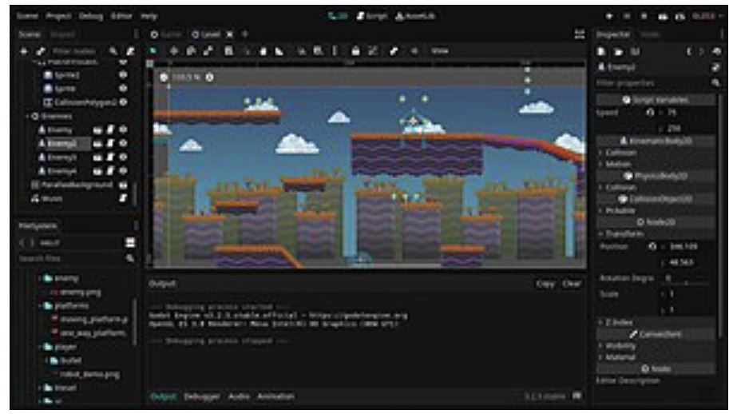
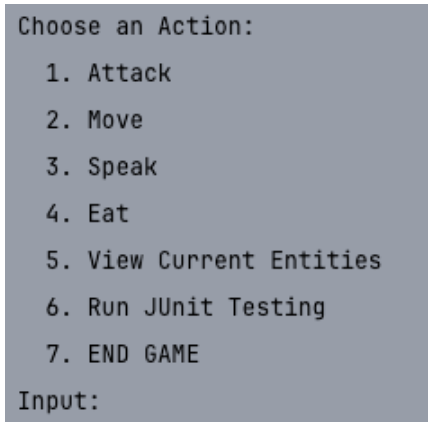
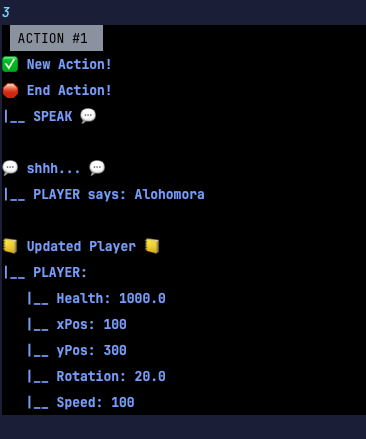
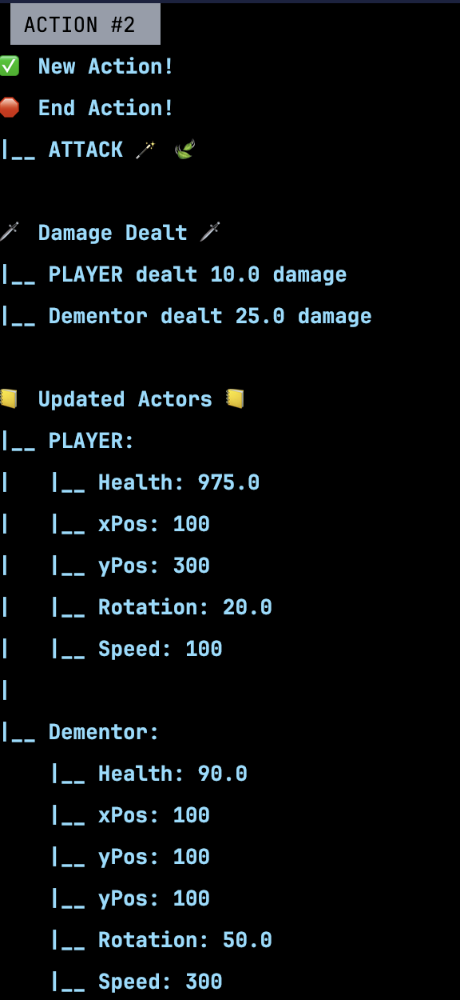
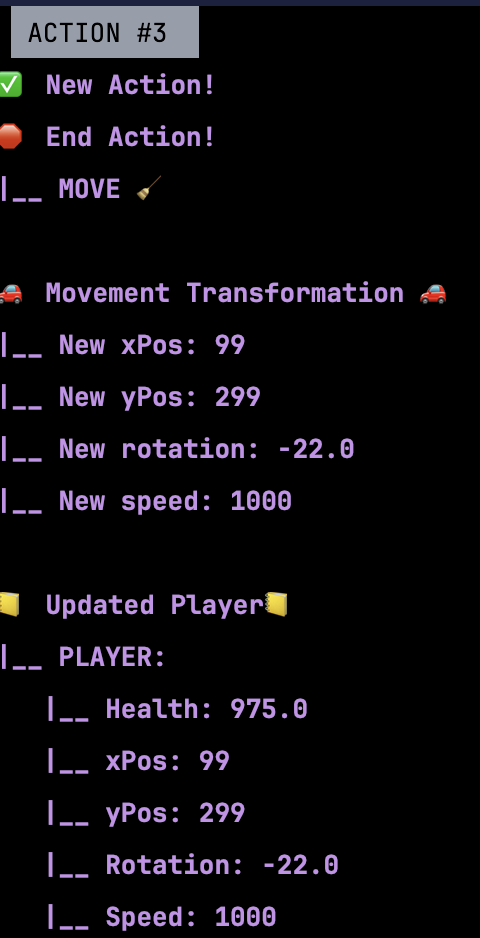
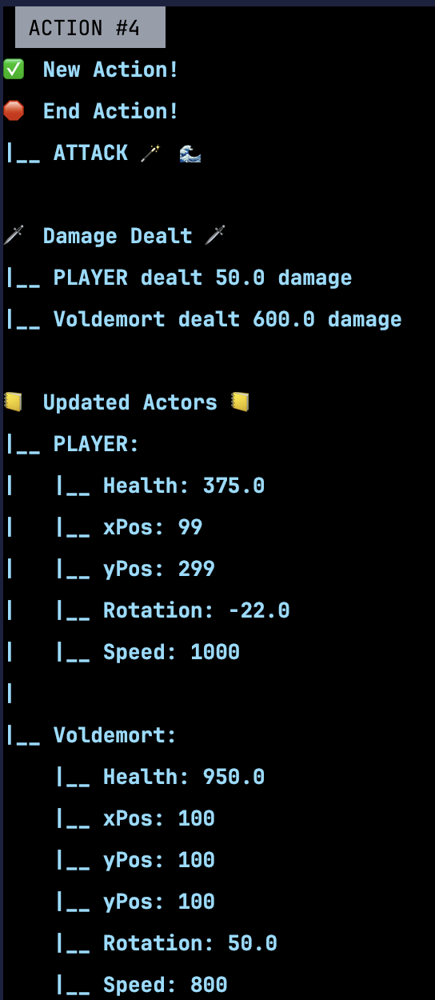
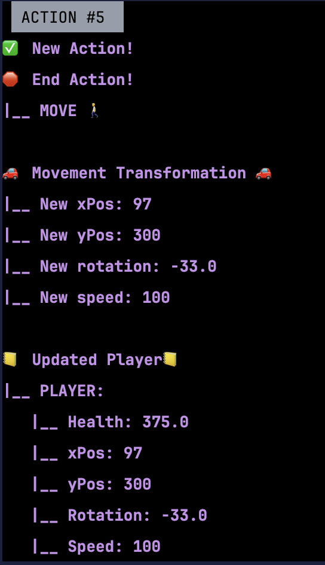
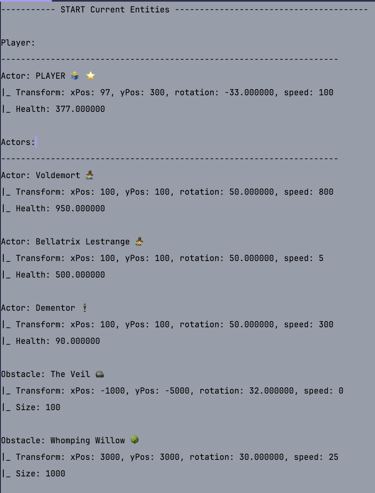
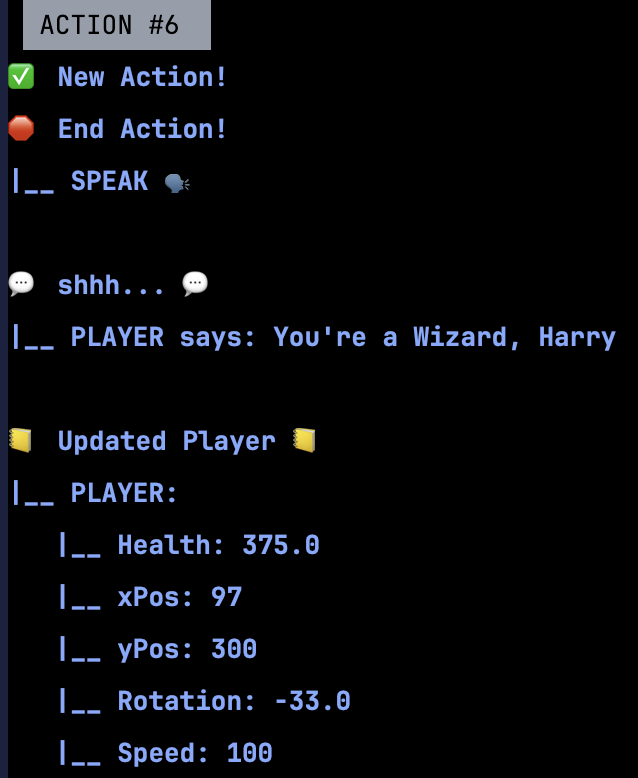
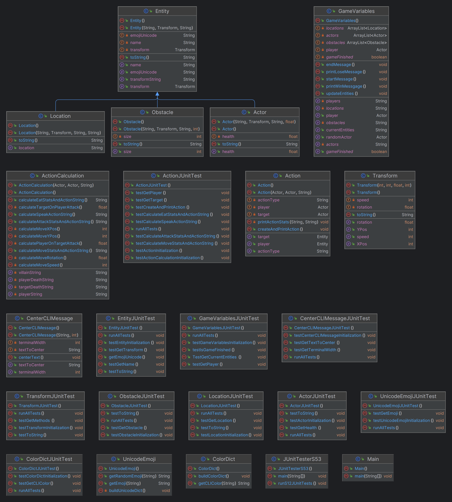

# **S53_GameEngine_Medium**

{width="500"}

[**Wikipedia**](https://en.wikipedia.org/wiki/Game_engine)

## **🔗 Links**
- [Return Home](Home)
- [Return to Oral Exam 1](https://class-git.engineering.uiowa.edu/swd2024fall/mnkrueger/-/wikis/Landing-Page/Oral-Exam-1)

## **💻 Source Code**
- [**S53_GameEngine_Medium**](https://class-git.engineering.uiowa.edu/swd2024fall/mnkrueger/-/tree/master/oral_exam1/S53_GameEngine_Medium?ref_type=heads)

## **🗨️ Problem Statement**
Design a class hierarchy for a game engine by creating an **Entity** and **Transform** classes with attributes, methods, and subclasses. The Entity class will have the subclasses of Obstacle and Actor, representing different entities inside of the game. The Transform class will contain methods to represent position in game. The game will be played through CLI.

## **🎮 User Documentation**

 Snapshot taken from CLI output.

---
Upon starting the game, the user will be given **6 options** of actions to choose from: 
- **Attack:** Player(Actor) on Actor (1) 

- **Move:** Player(Actor) on self (2) 

- **Speak:** Player(Actor) on self (3) 

- **Eat:** Player(Actor) on self (4) 

- **View Current Entities:** Outputs all current entities (5) 

- **Run JUnit Testing:** Runs all JUnit tests inside test/ directory (6).

- **END GAME:** Terminate game (7).

## **✏️ Developer Documentation**
**Entry Point:**
- [**S53_GameEngine_Medium/src/Main.java**](https://class-git.engineering.uiowa.edu/swd2024fall/mnkrueger/-/blob/master/oral_exam1/S53_GameEngine_Medium/src/Main.java?ref_type=heads) Manage user input & game loop.

**Packages:**
- [**S53_GameEngine_Medium/src/entities**](https://class-git.engineering.uiowa.edu/swd2024fall/mnkrueger/-/tree/master/oral_exam1/S53_GameEngine_Medium/src/entities?ref_type=heads) Defines Entity classes (Entity, Actor, Obstacle, Location).

- [**S53_GameEngine_Medium/src/actions**](https://class-git.engineering.uiowa.edu/swd2024fall/mnkrueger/-/tree/master/oral_exam1/S53_GameEngine_Medium/src/actions?ref_type=heads) Handles Action mapping and calculation (Action, ActionCalculation).

- [**S53_GameEngine_Medium/src/game**](https://class-git.engineering.uiowa.edu/swd2024fall/mnkrueger/-/tree/master/oral_exam1/S53_GameEngine_Medium/src/game?ref_type=heads) Initializes game variables (GameVariables).

- [**S53_GameEngine_Medium/src/styling**](https://class-git.engineering.uiowa.edu/swd2024fall/mnkrueger/-/tree/master/oral_exam1/S53_GameEngine_Medium/src/styling?ref_type=heads) Command line interface styling (CenterCLIMessage, ColorDict, UnicodeEmoji).

**Testing:** 
- [**S53_GameEngine_Medium/test/**](https://class-git.engineering.uiowa.edu/swd2024fall/mnkrueger/-/tree/master/oral_exam1/S53_GameEngine_Medium/test?ref_type=heads) Mirrors src/ directory & contains JUnit testing for respective modules.

- [**S53_GameEngine_Medium/test/JUnitTesterS53.java**](https://class-git.engineering.uiowa.edu/swd2024fall/mnkrueger/-/blob/master/oral_exam1/S53_GameEngine_Medium/test/S53_GameEngine_Medium_JUnitTester.java?ref_type=heads) Script to run _all_ tests inside test/ directory at once.

**Documentation**
- [**S53_GameEngine_Medium/doc/**](https://class-git.engineering.uiowa.edu/swd2024fall/mnkrueger/-/tree/master/oral_exam1/S53_GameEngine_Medium/doc?ref_type=heads) Project Javadocs & UML png.

- [**S53_GameEngine_Medium/imgs/**](https://class-git.engineering.uiowa.edu/swd2024fall/mnkrueger/-/tree/master/oral_exam1/S53_GameEngine_Medium/imgs?ref_type=heads) Includes S12_UML.png

## **📈 Areas for Improvement**
- **Combine Action & ActionCalculation:** These classes should be combined as their methods are convoluted. Neither ActionCalculation follow the Principle of Least Privilege (P.O.L.P).  

- **Improve CLI Styling:** The styling package includes many messy modules to style the output of the CLI game in a very messy way. _(Note the repeated 'messy' adjective here)_.

- **Game loop:** Create a testable loop. Maybe move outside of Main.java and to a different package? Not sure the best way to achieve this.

- **Structuring:** Adhere to P.O.L.P. to allow for more comprehensive JUnit testing. Also better utilize static methods and incorporate catches and throws.

- **Documentation:** Follow Javadoc best practices / create personal style to follow for future.

## **📸 Sample Outputs**

  
  
  
  
  
  
  

## 🖼️ UML Diagram

  
  

## ⚠️ Important Note!

The projects contained inside this repository are Java projects. Please be aware that I did not include any configuration files that could be easily ported to IDEs such as IntelliJ. You will need to set up your own project configuration if you wish to import these projects into an IDE.
 
Additionally, many of the links may point to gitlab pages - which you will likely not be able to access.

