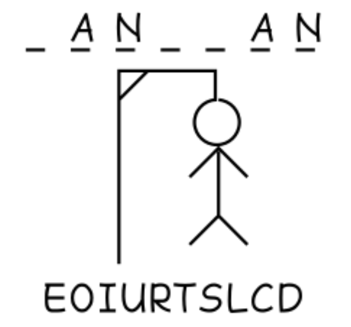
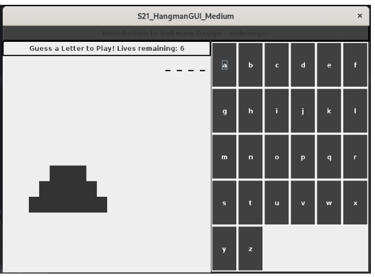
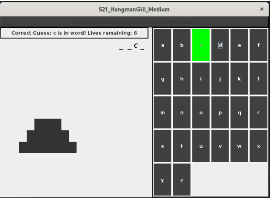
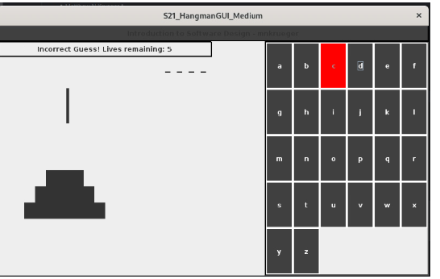
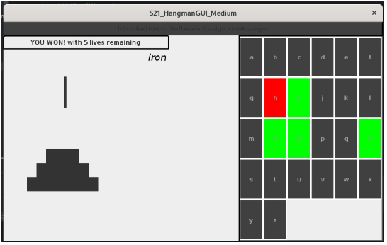
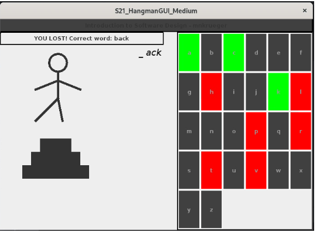
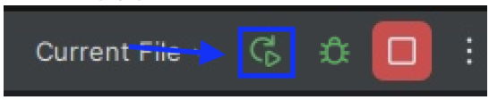
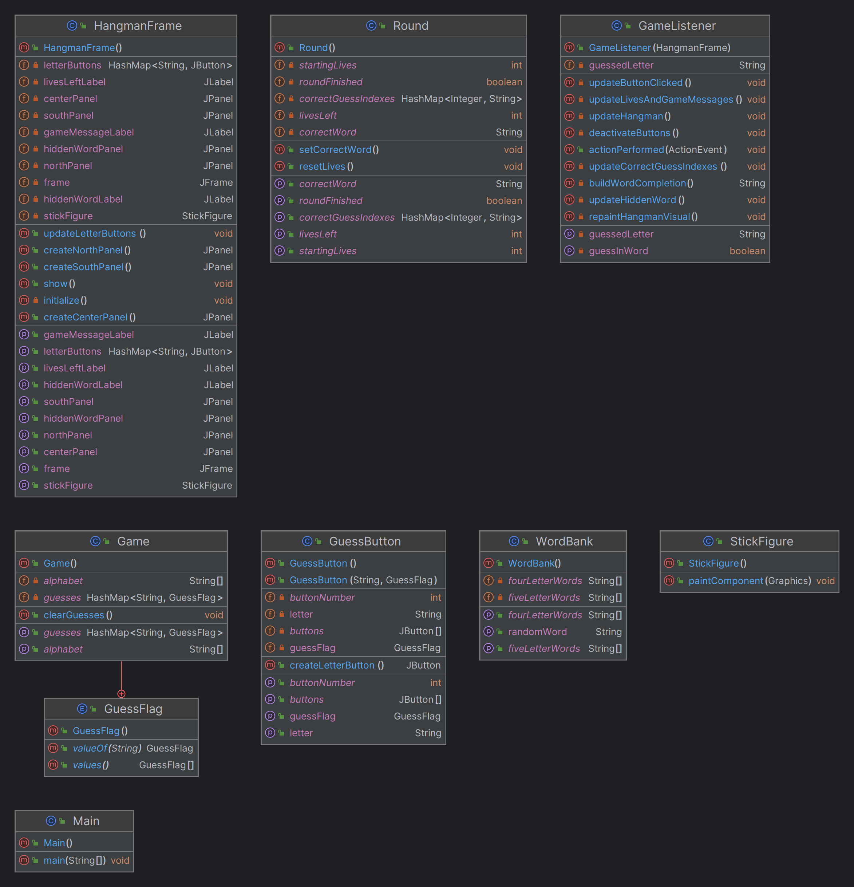

# S21_HangmanGUI_Medium

  

[**Wikipedia**](https://en.wikipedia.org/wiki/Hangman_game)

## **🔗 Links**
- [Return Home](Home)
- [Return to Oral Exam 1](https://class-git.engineering.uiowa.edu/swd2024fall/mnkrueger/-/wikis/Landing-Page/Oral-Exam-1)

## **💻 Source Code**
- [S21_HangmanGUI_Medium](https://class-git.engineering.uiowa.edu/swd2024fall/mnkrueger/-/tree/master/oral_exam1/S21_HangmanGUI_Medium?ref_type=heads)

## **🗨️ Problem Statement**
Create a graphical user interface for the game: **Hangman**. Include a system to **obtain user guess**, while keeping the correct answer hidden. GUI should **display the drawing** of the hangman as user guesses continue, ending with a winning/losing message. 
 
## **🎮 User Documentation**
Upon starting the script, the user will be presented a frame containing 26 buttons (user guesses), and a sequence of underscores (letters present in correct word). To play the user will click a button to send a guess. 

  

If the user guesses correctly, an underscore or underscores will be revealed. If the user guesses wrong, a body part of a stick figure will be drawn, and a life removed. The user has 6 lives. 

  

  

Winning message:

  

Losing message:

  

As of now, there is no method of restarting the game using the GUI, but functionality can be extended with some of the additional methods I provided in gameLogic & variables packages. For now, simply press the restart button:

  

## **✏️ Developer Documentation**
**Entry Point:**
- [**S21_HangmanGUI_Medium/src/Main.java**](https://class-git.engineering.uiowa.edu/swd2024fall/mnkrueger/-/blob/master/oral_exam1/S21_Hangman_Medium/src/Main.java) Creates frame using Java Swing components.

**Packages:**
- [**S21_HangmanGUI_Medium/src/variables**](https://class-git.engineering.uiowa.edu/swd2024fall/mnkrueger/-/tree/master/oral_exam1/S21_Hangman_Medium/src/variables) Constants & static methods to track game.

- [**S21_HangmanGUI_Medium/src/gameLogic**](https://class-git.engineering.uiowa.edu/swd2024fall/mnkrueger/-/tree/master/oral_exam1/S21_Hangman_Medium/src/gameLogic) Game listener and round methods. Hangman logic after each registered guess.

- [**S21_HangmanGUI_Medium/src/gui**](https://class-git.engineering.uiowa.edu/swd2024fall/mnkrueger/-/tree/master/oral_exam1/S21_Hangman_Medium/src/gui) Components present inside of game. Also holds initialization class.

**Testing:** 
- No testing included in this project. 

**Documentation:**
- [**S21_HangmanGUI_Medium/doc/**](https://class-git.engineering.uiowa.edu/swd2024fall/mnkrueger/-/tree/master/oral_exam1/S21_Hangman_Medium/doc) Includes JavaDoc

- [**S21_HangmanGUI_Medium/imgs/**](https://class-git.engineering.uiowa.edu/swd2024fall/mnkrueger/-/tree/master/oral_exam1/S21_Hangman_Medium/imgs) Includes S21_UML.png

## 🖼️ UML Diagram

## ⚠️ Important Note!

The projects contained inside this repository are Java projects. Please be aware that I did not include any configuration files that could be easily ported to IDEs such as IntelliJ. You will need to set up your own project configuration if you wish to import these projects into an IDE.
 
Additionally, many of the links may point to gitlab pages - which you will likely not be able to access.