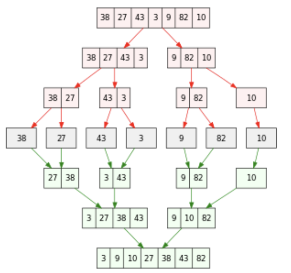
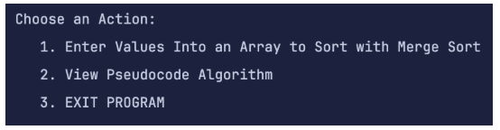
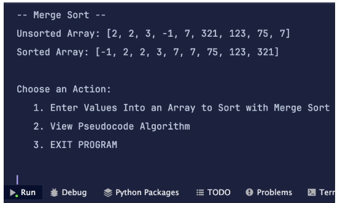
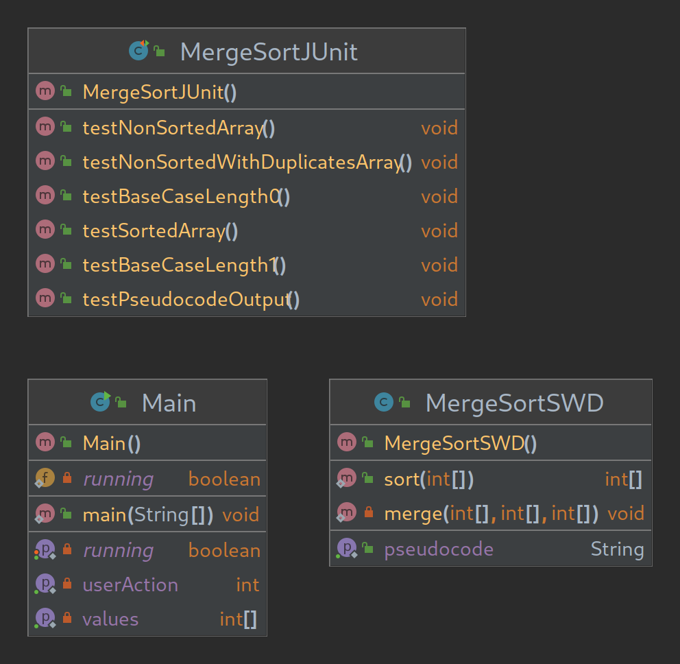

# S18_MergeSort_Medium

  

[Wikipedia](https://en.wikipedia.org/wiki/Merge_sort)

## **🔗 Links**
- [**Return Home**](Home)
- [**Return to Oral Exam 2**](https://class-git.engineering.uiowa.edu/swd2024fall/mnkrueger/-/wikis/Landing-Page/Oral-Exam-2)

## **💻 Source Code**
- [S18_MergeSort_Medium](https://class-git.engineering.uiowa.edu/swd2024fall/mnkrueger/-/tree/master/oral_exam2/S18_MergeSort_Medium?ref_type=heads)

## **🗨️ Problem Statement**
Implement the **Merge Sort** algorithm using Java. Include **JUnit** testing to validate the code.
 
## **🎮 User Documentation**
When the user starts the program, the following will be printed to the console asking for a user action.

  

Available Actions:
1. **Enter Values...:** prompts the user to enter single character integers into the console to create a list to be sorted by the algorithm 
2. **View Pseudocode Algorithm:** provides algorithm pseudocode linked in Icon ([attribution](https://www.toptal.com/developers/sorting-algorithms/merge-sort))
3. **EXIT PROGRAM:** exits the program

Sorted Array after entering values ('q' to stop entering)

  

## **✏️ Developer Documentation**
**Entry Point:** [**oral_exam2/S18_MergeSort_Medium/src/Main.java**](https://class-git.engineering.uiowa.edu/swd2024fall/mnkrueger/-/blob/master/oral_exam2/S18_MergeSort_Medium/src/Main.java?ref_type=heads)

**Packages:**
- [**main/java/mergesort**](https://class-git.engineering.uiowa.edu/swd2024fall/mnkrueger/-/tree/master/oral_exam2/S18_MergeSort_Medium/src/main/java/mergesort?ref_type=heads) contains [**MergeSortSWD.java**](https://class-git.engineering.uiowa.edu/swd2024fall/mnkrueger/-/blob/master/oral_exam2/S18_MergeSort_Medium/src/main/java/mergesort/MergeSortSWD.java?ref_type=heads) which provides algorithm 
**Testing:** 
- [**test/java/mergesort**](https://class-git.engineering.uiowa.edu/swd2024fall/mnkrueger/-/tree/master/oral_exam2/S18_MergeSort_Medium/src/test/java/mergesort?ref_type=heads) contains junit tests for MergeSortSWD class

**Documentation:**
- javadocs: https://class-git.engineering.uiowa.edu/swd2024fall/mnkrueger/-/tree/master/oral_exam2/S18_MergeSort_Medium/doc?ref_type=heads

## 🖼️ UML Diagram

  

## ⚠️ Important Note!

The projects contained inside this repository are Java projects. Please be aware that I did not include any configuration files that could be easily ported to IDEs such as IntelliJ. You will need to set up your own project configuration if you wish to import these projects into an IDE.
 
Additionally, many of the links may point to gitlab pages - which you will likely not be able to access.