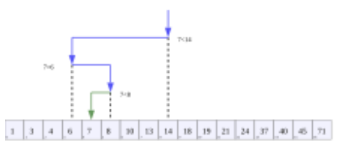
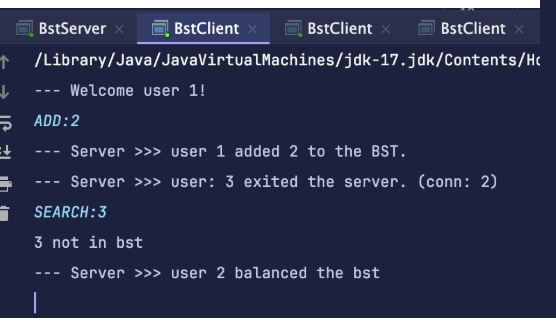
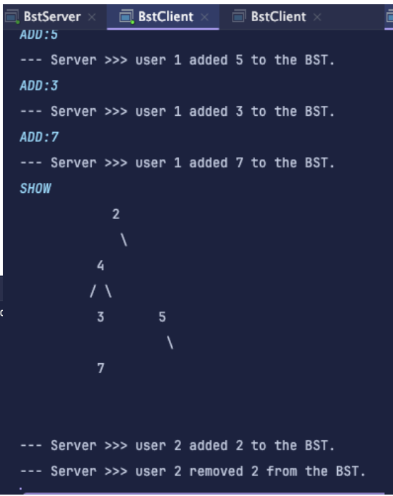
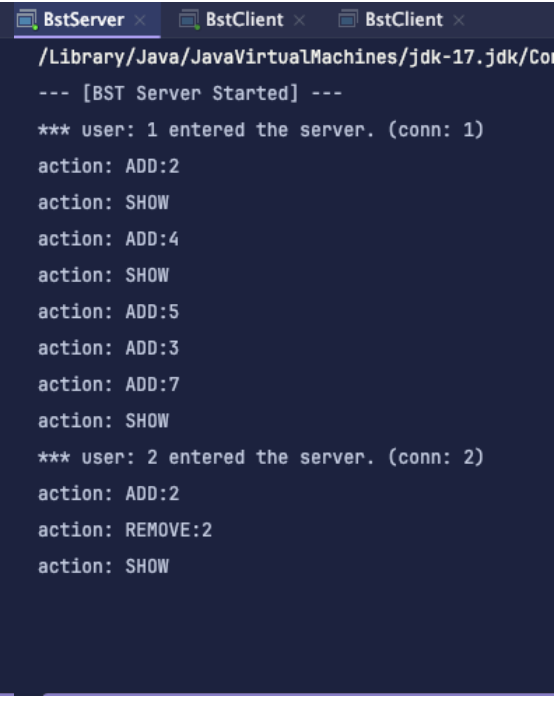
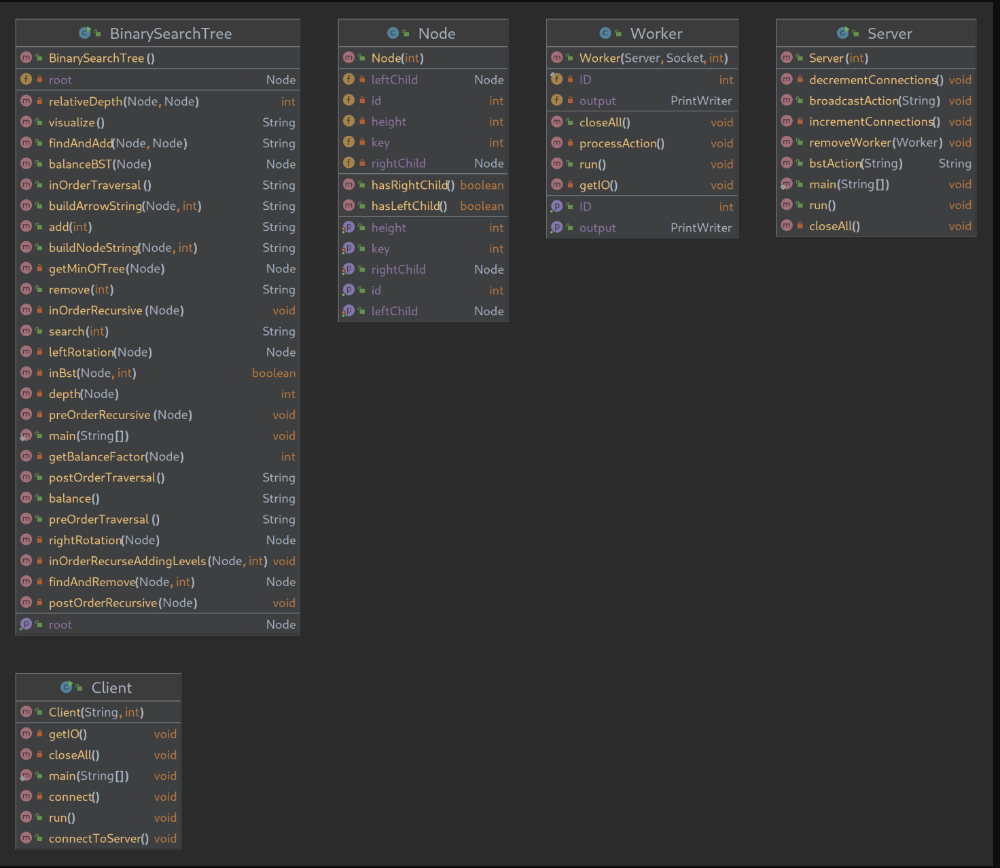

# S44_NetworkedBinarySearchTree_Hard

  

[Wikipedia](https://en.wikipedia.org/wiki/Binary_search)

## **🔗 Links**
- [**Return Home**](Home)
- [**Return to Oral Exam 2**](https://class-git.engineering.uiowa.edu/swd2024fall/mnkrueger/-/wikis/Landing-Page/Oral-Exam-2)

## **💻 Source Code**
- src: https://class-git.engineering.uiowa.edu/swd2024fall/mnkrueger/-/tree/master/oral_exam2/S44_NetworkedBinarySearchTree_Hard/src?ref_type=heads
## **🗨️ Problem Statement**
 Create a multithreaded server in the CLI to communicate with multiple clients on the while sharing the same Binary Search Tree. Implement visual to print to screen. 
## **🎮 User Documentation**
1. start server
2. start client(s) - server is now listening indefinitely.
3. interact through the client cli

  

Valid client actions:
1. 'ADD:#' -> adds specified key (changes broadcasted)
2. 'REMOVE:#' -> removes specified key (changes broadcasted)
3. 'SEARCH:#' -> searches for specified key
4. 'PRE' -> preorder traversal of the bst
5. 'IN' -> in order traversal of the bst
6. 'POST' -> post order traversal of the bst 
7. 'BALANCE' -> balances the bst (changes broadcasted)
8. 'SHOW' -> show text based representation of the tree 

## **✏️ Developer Documentation**
**Entry Point:**
- [client:](https://class-git.engineering.uiowa.edu/swd2024fall/mnkrueger/-/blob/master/oral_exam2/S44_NetworkedBinarySearchTree_Hard/src/Network/Client.java?ref_type=heads)
- [server:](https://class-git.engineering.uiowa.edu/swd2024fall/mnkrueger/-/blob/master/oral_exam2/S44_NetworkedBinarySearchTree_Hard/src/Network/Server.java?ref_type=heads)

**Packages:**
- [network](https://class-git.engineering.uiowa.edu/swd2024fall/mnkrueger/-/tree/master/oral_exam2/S44_NetworkedBinarySearchTree_Hard/src/Network?ref_type=heads) Client, Server, and Worker classes. Worker handles the bound connection between the server and the client. (it does this server-side)
- [bst](https://class-git.engineering.uiowa.edu/swd2024fall/mnkrueger/-/tree/master/oral_exam2/S44_NetworkedBinarySearchTree_Hard/src/bst?ref_type=heads) BinarySearchTree and Node classes. 

**Documentation:**
- javadocs: https://class-git.engineering.uiowa.edu/swd2024fall/mnkrueger/-/tree/master/oral_exam2/S44_NetworkedBinarySearchTree_Hard/doc?ref_type=heads

## 🖼️ UML Diagram

  

## ⚠️ Important Note!

The projects contained inside this repository are Java projects. Please be aware that I did not include any configuration files that could be easily ported to IDEs such as IntelliJ. You will need to set up your own project configuration if you wish to import these projects into an IDE.
 
Additionally, many of the links may point to gitlab pages - which you will likely not be able to access.