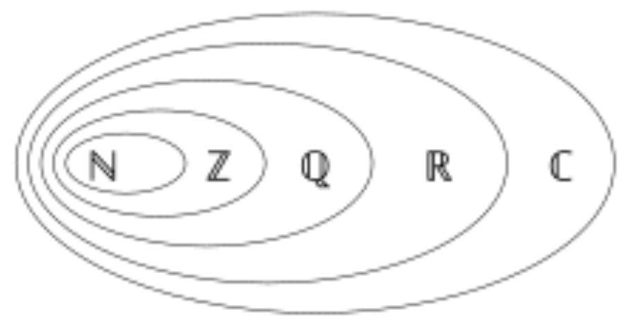
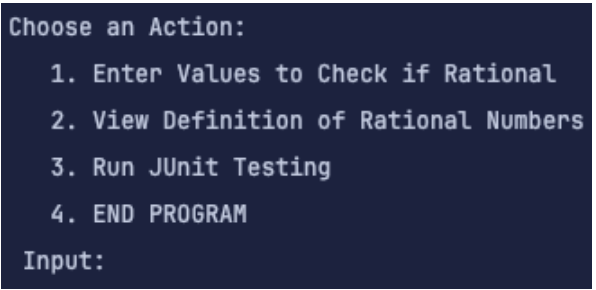
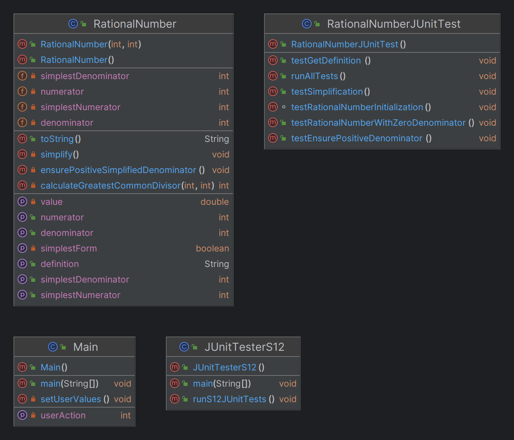

# S12_RationalNumbers_Medium

  

## **🔗 Links**
- [Return Home](Home)
- [Return to Oral Exam 1](https://class-git.engineering.uiowa.edu/swd2024fall/mnkrueger/-/wikis/Landing-Page/Oral-Exam-1)

## **💻 Source Code**
- [**S12_RationalNumbers_Medium**](https://class-git.engineering.uiowa.edu/swd2024fall/mnkrueger/-/tree/master/oral_exam1/S12_RationalNumbers_Medium?ref_type=heads)

## **🗨️ Problem Statement**
Create a class representing **rational numbers** with fields numerator (a) and denominator (b). Store the ratio of the two integers a & b in simplest form and write comprehensive **JUnit testing** to confirm the validity of the program.
 
## **🎮 User Documentation**

 Snapshot taken from CLI output.

---
Upon starting the game, the user will be given **6 options** of actions to choose from: 
- **Enter Values to Check if Rational:** Enter another prompt to enter a numerator and denominator. This will return the rational number, its simplified form, and its ratio (1) 

- **View Definition of Rational Numbers:** Outputs the definition of a rational number (2) 

- **Run JUnit Testing:** Runs all JUnit tests inside test/ directory (3) 

- **END PROGRAM:** Terminate program (4) 

## **✏️ Developer Documentation**
**Entry Point:**
- [**S12_RationalNumbers_Medium/src/Main.java**](https://class-git.engineering.uiowa.edu/swd2024fall/mnkrueger/-/blob/master/oral_exam1/S12_RationalNumbers_Medium/src/Main.java?ref_type=heads) Manage user input.

**Packages:**
- [**S12_RationalNumbers_Medium/src/entities**](https://class-git.engineering.uiowa.edu/swd2024fall/mnkrueger/-/tree/master/oral_exam1/S12_RationalNumbers_Medium/src/numbers?ref_type=heads) Defines rational number object (RationalNumber).

**Testing:** 
- [**S12_RationalNumbers_Medium/test/**](https://class-git.engineering.uiowa.edu/swd2024fall/mnkrueger/-/tree/master/oral_exam1/S12_RationalNumbers_Medium/test?ref_type=heads) Mirrors src/ directory & contains JUnit testing for respective modules.

- [**S12_RationalNumbers_Medium/test/JUnitTesterS12.java**](https://class-git.engineering.uiowa.edu/swd2024fall/mnkrueger/-/blob/master/oral_exam1/S12_RationalNumbers_Medium/src/test/JUnitTesterS12.java?ref_type=heads) Script to run _all_ tests inside test/ directory at once.

**Documentation:**
- [**S12_RationalNumbers_Medium/doc/**](https://class-git.engineering.uiowa.edu/swd2024fall/mnkrueger/-/tree/master/oral_exam1/S12_RationalNumbers_Medium/doc?ref_type=heads) Includes JavaDoc

- [**S12_RationalNumbers_Medium/imgs/**](https://class-git.engineering.uiowa.edu/swd2024fall/mnkrueger/-/tree/master/oral_exam1/S12_RationalNumbers_Medium/imgs?ref_type=heads) Includes S12_UML.png

## 🖼️ UML Diagram

{width="300"}

- **Include Visual:** Print out steps to CLI to show user process of GCD. 

- **Documentation:** Follow Javadoc best practices / create personal style to follow for future.

## ⚠️ Important Note!

The projects contained inside this repository are Java projects. Please be aware that I did not include any configuration files that could be easily ported to IDEs such as IntelliJ. You will need to set up your own project configuration if you wish to import these projects into an IDE.
 
Additionally, many of the links may point to gitlab pages - which you will likely not be able to access.