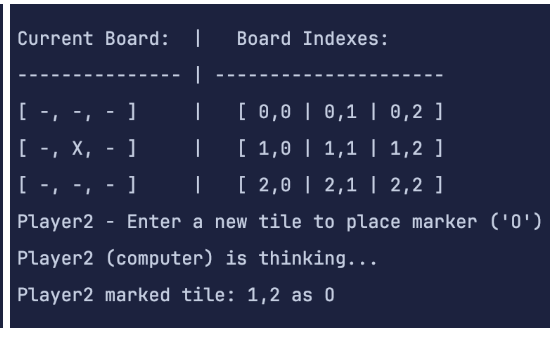

# S20_TicTacToe_Hard

  

[Wikipedia](https://en.wikipedia.org/wiki/Tic-tac-toe)

## **🔗 Links**
- [**Return Home**](Home)
- [**Return to Oral Exam 2**](https://class-git.engineering.uiowa.edu/swd2024fall/mnkrueger/-/wikis/Landing-Page/Oral-Exam-2)

## **💻 Source Code**
- [S20_TicTacToe_Hard_CLI](https://class-git.engineering.uiowa.edu/swd2024fall/mnkrueger/-/tree/master/oral_exam2/S20_TicTacToe_Hard_CLI?ref_type=heads)

- UNGRADED GUI: [S20_TicTacToe_Medium_GUI](https://class-git.engineering.uiowa.edu/swd2024fall/mnkrueger/-/tree/master/oral_exam2/S20_TicTacToe_Medium_GUI)

## **🗨️ Problem Statement**
Create a **Tic-Tac-Toe** game that allows different player combinations: human vs. computer, human vs. human, and computer vs. computer. The game should display the board after each move, check for a winner or a tie, and end with a status message when the game concludes. Use **object-oriented programming** with classes for the board, and players.
 
## **🎮 User Documentation**
When starting the program, the console will present the following message:

  

There are three game modes:
1. Multi Player: Play against a friend locally
2. Single Player: Play against a non-player computer 
3. Spectator: Watch two non-player computers play each other
4. EXIT GAME: exit program

## **1. Multi Player Directions:**
The game alternates between **Player1** (human) and **Player2** (human), requesting moves from each. Each human player must enter a valid 'row,col' pair into the system. There is a visual showing the current status of the board as well as the indexes representing each square in the 3x3 grid. Player1 goes first with Player2 following. The game ends when there is a three-in-a-row by either player or a scratch is achieved.

   

## **2. Single Player Directions:**
The game alternates between **Player1** (human) and **Player2** (computer), requesting moves from each. The human, Player1, must enter a valid 'row,col' pair into the system. The computer player 'thinks' and randomly places a marker on the board once it has randomly entered a valid 'row,col' pair. Do not use interact with the screen while the computer is 'thinking' as you may lose track of where you are in the console log. There is a visual showing the current status of the board as well as the indexes representing each square in the 3x3 grid. Player1 goes first with Player2 following. The game ends when there is a three-in-a-row by either player or a scratch is achieved.

   

<space><space>

## **3. Spectator Directions:**
The game alternates between **Player1** (computer) and **Player2** (computer), requesting moves from each. Both computer players 'think' and randomly place markers on the board once a randomly entered 'row,col' pair is entered. Do not use interact with the screen throughout this game as you may lose track of where you are in the console log. There is a visual showing the current status of the board as well as the indexes representing each square in the 3x3 grid. Player1 goes first with Player2 following. The game ends when there is a three-in-a-row by either player or a scratch is achieved.

   

<space><space>

## **Game Over Screens:**
Left to right: Player1 Win, Player2 Win, Scratch.

    

<space><space>

## **✏️ Developer Documentation**
**Entry Point:**
- [Main.java](https://class-git.engineering.uiowa.edu/swd2024fall/mnkrueger/-/blob/master/oral_exam2/S20_TicTacToe_Hard_CLI/src/Main.java)

**Packages:**
- [players](https://class-git.engineering.uiowa.edu/swd2024fall/mnkrueger/-/tree/master/oral_exam2/S20_TicTacToe_Hard_CLI/src/players): Contains Tic-Tac-Toe player classes - [Player.java](https://class-git.engineering.uiowa.edu/swd2024fall/mnkrueger/-/blob/master/oral_exam2/S20_TicTacToe_Hard_CLI/src/players/Player.java) (parent class), [HumanPlayer.java](https://class-git.engineering.uiowa.edu/swd2024fall/mnkrueger/-/blob/master/oral_exam2/S20_TicTacToe_Hard_CLI/src/players/HumanPlayer.java) (human class extending Player.java), and [ComputerPlayer.java](https://class-git.engineering.uiowa.edu/swd2024fall/mnkrueger/-/blob/master/oral_exam2/S20_TicTacToe_Hard_CLI/src/players/ComputerPlayer.java) (computer player extending Player.java). These all contain the method makeMove() which are called during runtime (Method overriding polymorphism).
- [utils](https://class-git.engineering.uiowa.edu/swd2024fall/mnkrueger/-/tree/master/oral_exam2/S20_TicTacToe_Hard_CLI/src/utils): Contains Tic-Tac-Toe board and game logic classes - [Board.java](https://class-git.engineering.uiowa.edu/swd2024fall/mnkrueger/-/blob/master/oral_exam2/S20_TicTacToe_Hard_CLI/src/utils/Board.java) (represents the 3x3 grid, containing methods to safely populate the grid & check for a winner), [Game.java](https://class-git.engineering.uiowa.edu/swd2024fall/mnkrueger/-/blob/master/oral_exam2/S20_TicTacToe_Hard_CLI/src/utils/Game.java) (contains the game loop for Tic-Tac-Toe, calling makeMove() on Player objects).

**Testing:** 
- no testing is required for this project

**Documentation:**
- javadocs: https://class-git.engineering.uiowa.edu/swd2024fall/mnkrueger/-/tree/master/oral_exam2/S20_TicTacToe_Hard_CLI/doc?ref_type=heads

## 🖼️ UML Diagram

  

## ⚠️ Important Note!

The projects contained inside this repository are Java projects. Please be aware that I did not include any configuration files that could be easily ported to IDEs such as IntelliJ. You will need to set up your own project configuration if you wish to import these projects into an IDE.
 
Additionally, many of the links may point to gitlab pages - which you will likely not be able to access.