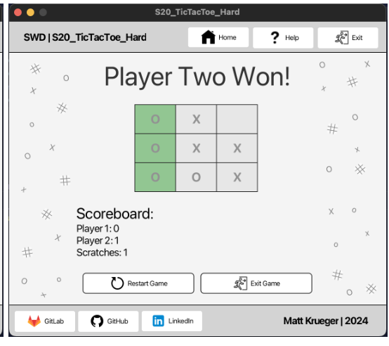

# S20_TicTacToe_UNGRADED (GUI)

  

[Wikipedia](https://en.wikipedia.org/wiki/Tic-tac-toe)

## **🔗 Links**

- [**Return Home**](Home)
- [**Return to Oral Exam 2**](https://class-git.engineering.uiowa.edu/swd2024fall/mnkrueger/-/wikis/Landing-Page/Oral-Exam-2)

## **💻 Source Code**

- [S20_TicTacToe_Medium_GUI](https://class-git.engineering.uiowa.edu/swd2024fall/mnkrueger/-/tree/master/oral_exam2/S20_TicTacToe_Medium_GUI?ref_type=heads)

## **🗨️ Problem Statement**

Create a **GUI** for the popular '**TicTacToe**' game using **JavaFX**. In this project, correctly model the game logic of TicTacToe, and provide interactive GUI for user to play the game visually. The game should differentiate players visually & correctly track the winner of the game and previous games.

## **:video_game: User Documentation**

## Upon starting the game, the user will be presented the following GUI. Press 'Play Tic-Tac-Toe' to begin the game. If you are unfamiliar with the rules, you can take a quick look at the 'Help' button located in the navbar.

  

  

## Once in the game, the user will be shown this view, containing a 3x3 grid of squares representing the Tic-Tac-Toe board.

  

## The players will alternate turns, by controlling the mouse and clicking on which 'tile' they would like to place their marker in.

   

## Once a three-in-a-row or scratch is achieved, the game will end, presenting one of the following game over screens:
From left to right: Player 1 Win, Player 2 Win, Scratch.

    

## After each game, the winner is tallied & tracked by the scoreboard.

  

To restart, click the 'Restart Game' button. To exit, click the 'Exit Game' button

  

## **✏️ Developer Documentation**
**Entry Point:** 
- [gui/Main.java](https://class-git.engineering.uiowa.edu/swd2024fall/mnkrueger/-/blob/master/oral_exam2/S20_TicTacToe_Medium_GUI/src/gui/Main.java?ref_type=heads)

**Packages:**
- [TicTacToe](https://class-git.engineering.uiowa.edu/swd2024fall/mnkrueger/-/tree/master/oral_exam2/S20_TicTacToe_Medium_GUI/src/TicTacToe?ref_type=heads): Contains [Board.java](https://class-git.engineering.uiowa.edu/swd2024fall/mnkrueger/-/blob/master/oral_exam2/S20_TicTacToe_Medium_GUI/src/TicTacToe/Board.java?ref_type=heads) representing 3x3 grid. Has methods for determining winner.
- [gui](https://class-git.engineering.uiowa.edu/swd2024fall/mnkrueger/-/tree/master/oral_exam2/S20_TicTacToe_Medium_GUI/src/gui?ref_type=heads): Contains three subpackages: [controllers](https://class-git.engineering.uiowa.edu/swd2024fall/mnkrueger/-/tree/master/oral_exam2/S20_TicTacToe_Medium_GUI/src/gui/controllers?ref_type=heads) (contains controllers for fxml pages. Tic-Tac-Toe game controller [GameController](https://class-git.engineering.uiowa.edu/swd2024fall/mnkrueger/-/blob/master/oral_exam2/S20_TicTacToe_Medium_GUI/src/gui/controllers/GameController.java?ref_type=heads) handles user interaction and maps it to game logic in respective utils packages), [fxml](https://class-git.engineering.uiowa.edu/swd2024fall/mnkrueger/-/tree/master/oral_exam2/S20_TicTacToe_Medium_GUI/src/gui/fxml?ref_type=heads) (contains all fxml code for gui pages), and [resources](https://class-git.engineering.uiowa.edu/swd2024fall/mnkrueger/-/tree/master/oral_exam2/S20_TicTacToe_Medium_GUI/src/gui/resources?ref_type=heads) (contains png files for gui icons).
- [utils](https://class-git.engineering.uiowa.edu/swd2024fall/mnkrueger/-/tree/master/oral_exam2/S20_TicTacToe_Medium_GUI/src/utils?ref_type=heads): Contains [BackgroundColors.java](https://class-git.engineering.uiowa.edu/swd2024fall/mnkrueger/-/blob/master/oral_exam2/S20_TicTacToe_Medium_GUI/src/utils/BackgroundColors.java?ref_type=heads) (for BorderPane coloring) and [WebPages.java](https://class-git.engineering.uiowa.edu/swd2024fall/mnkrueger/-/blob/master/oral_exam2/S20_TicTacToe_Medium_GUI/src/utils/WebPages.java?ref_type=heads) (for weblinks)

**Testing:**
* No testing was required for this project

**Documentation:**
- 

## 🖼️ UML Diagram
no uml for this because it was an ungraded project

## ⚠️ Important Note!

The projects contained inside this repository are Java projects. Please be aware that I did not include any configuration files that could be easily ported to IDEs such as IntelliJ. You will need to set up your own project configuration if you wish to import these projects into an IDE.
 
Additionally, many of the links may point to gitlab pages - which you will likely not be able to access.