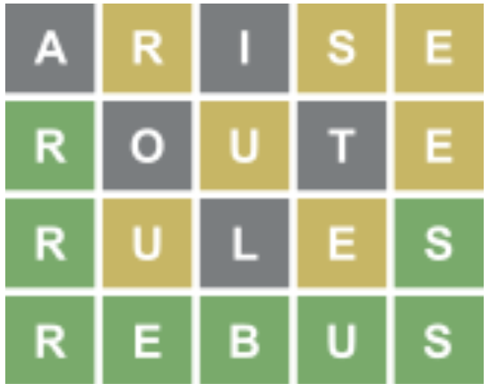
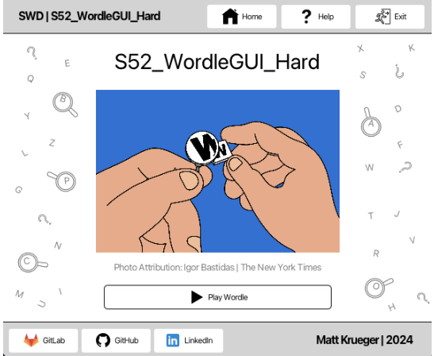
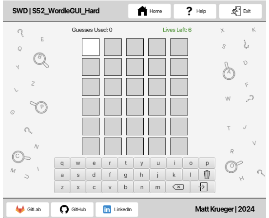
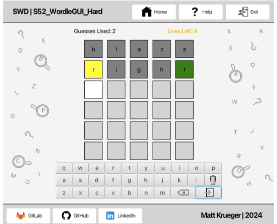
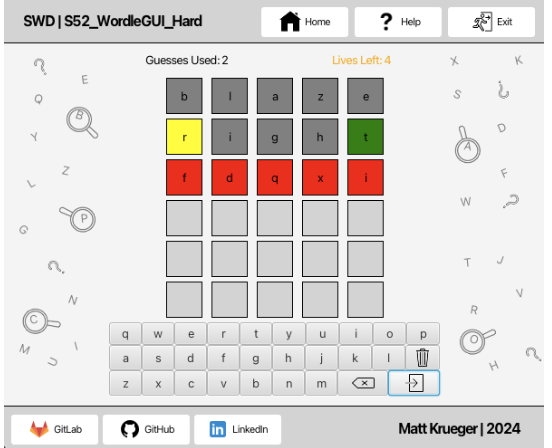
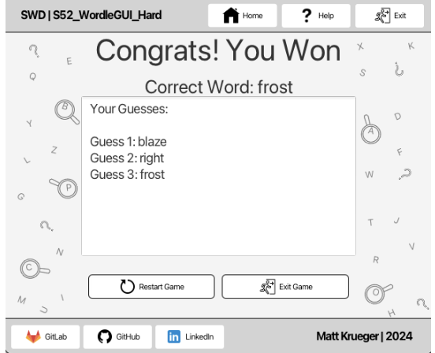
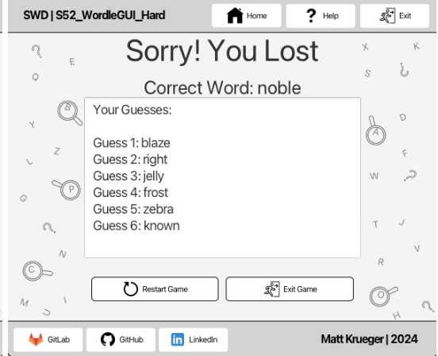
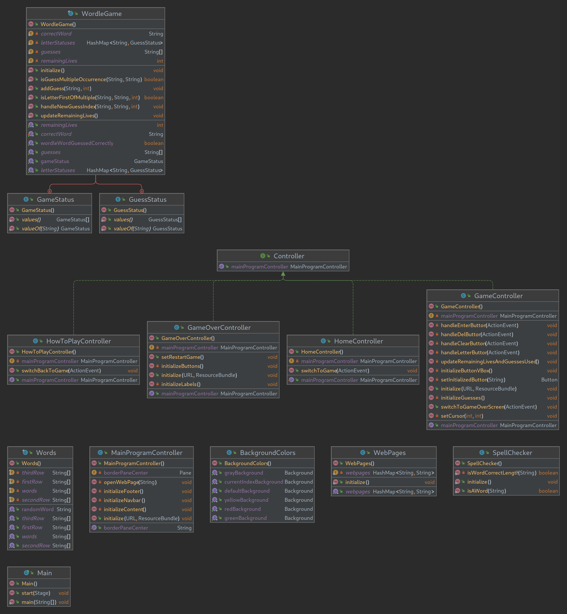

# S52_WordleGUI_Hard

[Wikipedia](https://en.wikipedia.org/wiki/Wordle)

## **🔗 Links**

- [**Return Home**](Home)
- [**Return to Oral Exam 2**](https://class-git.engineering.uiowa.edu/swd2024fall/mnkrueger/-/wikis/Landing-Page/Oral-Exam-2)

## **💻 Source Code**

- [S52_WordleGUI_Hard](https://class-git.engineering.uiowa.edu/swd2024fall/mnkrueger/-/tree/master/oral_exam2/S52_WordleGUI_Hard?ref_type=heads)

## **🗨️ Problem Statement**

Create a **GUI** for the popular '**_Wordle_**' game using **JavaFX**. In this project, correctly model the game logic of Wordle, and provide interactive GUI for user to play the game visually. Colors of guess letter buttons should reflect guess completion, and user lives displayed.

## **🎮 User Documentation**

Upon starting the game, the user will be presented the following GUI:

 

Press 'Play Wordle' to begin the game. If you are unfamiliar with the rules, you can take a quick look at the 'Help' button located in the navbar.

Once in the game, the user will be shown this view, containing a 6x5 grid of squares.

There are also 26 buttons representing a keyboard, with three additional icon buttons: **'clear'**: indicated by trashcan icon, this clears all guess letters in current row **'delete'**: indicated by backspace icon, this deletes the current index and moves back one spot **'enter'**: this submits the guess to the system Using these buttons, the user will interact with the Wordle game to construct and submit guesses.

Now that the game has begun, the user will have 6 guesses to enter a 5 letter word. Again, you are unfamiliar with the rules, I suggest you use the 'Help' button.

If the word is not a 5 letter word, or if it is not inside of the 5 letter word dictionary, the guess will flash red for 0.5 seconds before allowing the user to submit a new guess.

After the word is guessed correctly (win) or 6 incorrect guesses (loss), the game over screen will be shown, providing the solution and user guesses.

## **✏️ Developer Documentation**

**Entry Point:** [src/gui/Main.java](./src/gui/Main.java)

**Packages:**
- [**spellcheck**](https://class-git.engineering.uiowa.edu/swd2024fall/mnkrueger/-/tree/master/oral_exam2/S52_WordleGUI_Hard/src/spellcheck?ref_type=heads)
  * [resources](https://class-git.engineering.uiowa.edu/swd2024fall/mnkrueger/-/tree/master/oral_exam2/S52_WordleGUI_Hard/src/spellcheck/resources?ref_type=heads) contains [dictionary.txt](https://class-git.engineering.uiowa.edu/swd2024fall/mnkrueger/-/tree/master/oral_exam2/S52_WordleGUI_Hard/src/spellcheck/resources?ref_type=heads) holding all valid 5 letter words. 
  * [SpellChecker.java](https://class-git.engineering.uiowa.edu/swd2024fall/mnkrueger/-/blob/master/oral_exam2/S52_WordleGUI_Hard/src/spellcheck/SpellChecker.java?ref_type=heads) utility class that stores valid 5 letter words used to ensure user guess is a valid combination of letters.

- [**utils**](https://class-git.engineering.uiowa.edu/swd2024fall/mnkrueger/-/tree/master/oral_exam2/S52_WordleGUI_Hard/src/utils?ref_type=heads)
  * [BackgroundColors.java](https://class-git.engineering.uiowa.edu/swd2024fall/mnkrueger/-/blob/master/oral_exam2/S52_WordleGUI_Hard/src/utils/BackgroundColors.java?ref_type=heads) holds Background objects for wordle colors to limit LOC
  * [WebPages.java](https://class-git.engineering.uiowa.edu/swd2024fall/mnkrueger/-/blob/master/oral_exam2/S52_WordleGUI_Hard/src/utils/WebPages.java?ref_type=heads) storage of links (Gitlab, Github, LinkedIn)
  * [WordBank.java](https://class-git.engineering.uiowa.edu/swd2024fall/mnkrueger/-/blob/master/oral_exam2/S52_WordleGUI_Hard/src/utils/WordBank.java?ref_type=heads) Stores 30 words for possible correct words
  * [{+**WordleGame.java**+}](https://class-git.engineering.uiowa.edu/swd2024fall/mnkrueger/-/blob/master/oral_exam2/S52_WordleGUI_Hard/src/utils/WordleGame.java?ref_type=heads) utility class to handle wordle game. Used by wordleGUI package.

- [**wordleGUI**](mnkrueger/oral_exam2/S52_Wordle_GUI_Hard/src/wordleGUI/wordleGUI) 
  * [Controllers](https://class-git.engineering.uiowa.edu/swd2024fall/mnkrueger/-/tree/master/oral_exam2/S52_WordleGUI_Hard/src/wordleGUI/controllers?ref_type=heads) wordle GUI javaFX controllers
  * [fxml](https://class-git.engineering.uiowa.edu/swd2024fall/mnkrueger/-/tree/master/oral_exam2/S52_WordleGUI_Hard/src/wordleGUI/fxml?ref_type=heads) wordle javaFX markdown language pages for GUI
  * [resources](https://class-git.engineering.uiowa.edu/swd2024fall/mnkrueger/-/tree/master/oral_exam2/S52_WordleGUI_Hard/src/wordleGUI/resources?ref_type=heads) contains png images for icons used inside of fxml code
(There is a lot of nesting here, so I am staying top level. Please refer to source code)

**Testing:**

* No testing was required for this project

**Documentation:**
- javadocs: https://class-git.engineering.uiowa.edu/swd2024fall/mnkrueger/-/tree/master/oral_exam2/S52_WordleGUI_Hard/doc?ref_type=heads

## 🖼️ UML Diagram

## ⚠️ Important Note!

The projects contained inside this repository are Java projects. Please be aware that I did not include any configuration files that could be easily ported to IDEs such as IntelliJ. You will need to set up your own project configuration if you wish to import these projects into an IDE.
 
Additionally, many of the links may point to gitlab pages - which you will likely not be able to access.