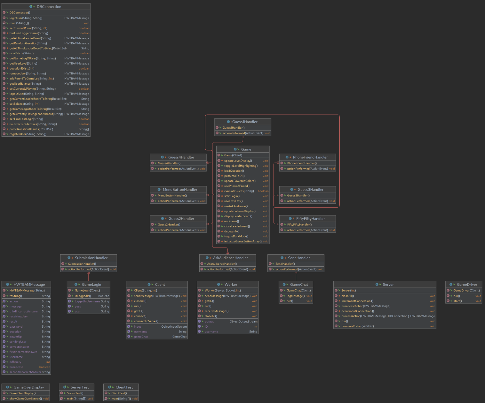
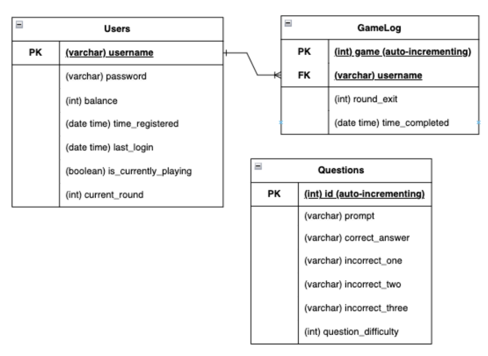
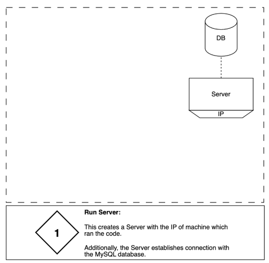
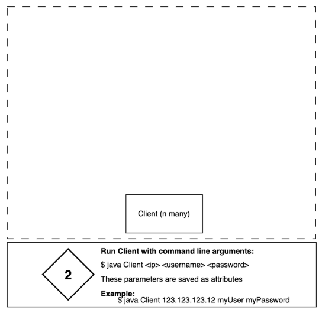
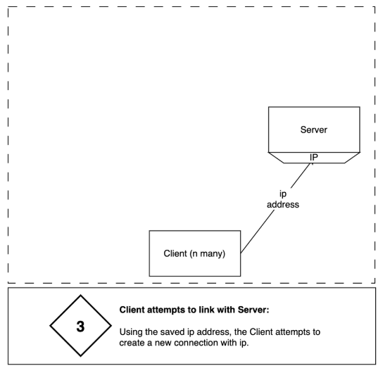
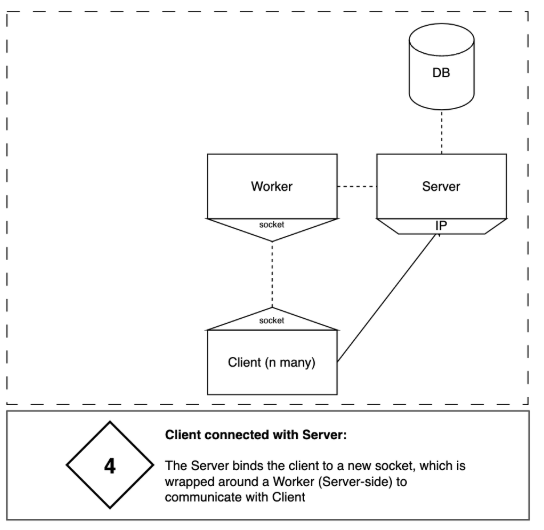
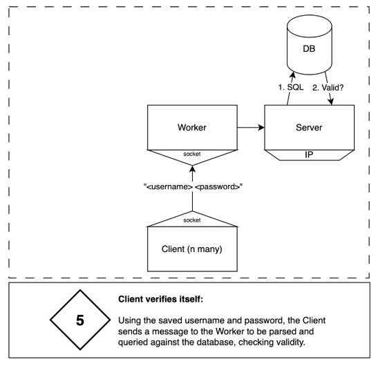
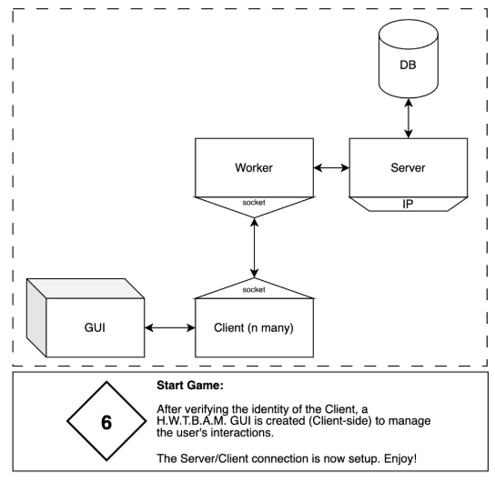
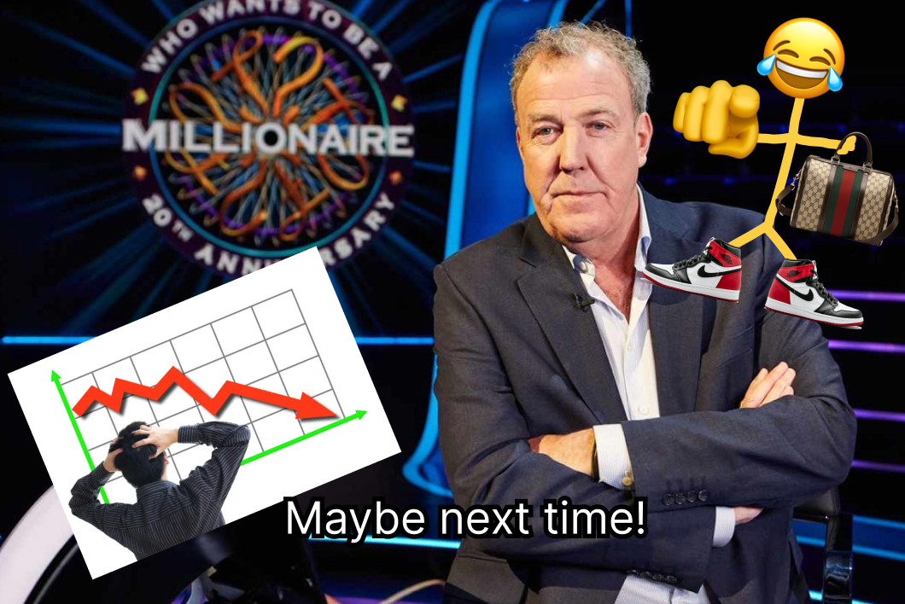

# Final_Project_SWD
This project was completed as part of a team effort for the Software Design course at the University of Iowa.

Teammates: Scott Pearson & Xavier Urhmacher

### My Responsibilities
- ERD, Database schema & sql statements
- Multithreaded Server/Client Architecture & respective communication functions between server and client
- Game chat functionality
- Project Architecture slides (images enclosed by dashed lines)
- Admin page
- Loss display

# Who Wants to be a Millionaire?
Multithreaded Server/Client GUI application written in Java. Game theme is _"Who Wants to be a Millionaire?"_

## Problem Statement

Implement a variation of Who Wants to Be a Millionaire. This game must feature-rich, multi-user trivia game platform, emphasizing interactive and competitive gameplay experiences in a networked environment. The game must exceed these specifications:

**Minimum Specification (General)**

1. Graphical User Interface (GUI) Client: Design a visually engaging GUI for players.

- Clients must connect to the server and be able to verify identity of user
- A client can register a new user or allow them to log in.

2. Networked Server Component: Implement a server to manage interactions between clients, maintaining smooth and consistent multiplayer sessions.

- The server must allow for at least eight distinct registered users, with unique identifiers
- Multiple simultaneous client-server interactions must be supported.
- The server component facilitates interactions between clients
- Multiple simultaneous games are not part of the minimum specification.

3. Multiplayer Capability: Support real-time, multi-user interactions within an instance of the trivia game, allowing players to compete in real time.
4. Account System with Password Protection: Implement an account system requiring unique identifiers for each user.
5. Real-Time Leaderboards: Display live rankings during gameplay to boost competition and engagement.
6. Scoring and Progress Tracking: Track user scores, providing leaderboards or rankings for added competition.

**Minimum Specifications (Trivia Games)**

1. Trivia Game Selection: Implement one of the listed trivia games (or an approved alternative). The games must provide engaging, varied rounds of questions, with an escalating challenge level.
2. Gameplay Persistence: Ensure that the server retains important game information, such as user scores, even if the client disconnects.
3. Player Progression and Rewards: Accumulate in-game currency through correct answers or game progression.
4. Game Configuration Options: Allow users to customize certain aspects of the gameplay (e.g., difficulty level, question categories).

**Minimum Specifications (Multiplayer)**

1. Real-Time Gameplay: Support synchronous multiplayer gameplay, allowing multiple players to answer questions and see results in real time.
2. Social Features: Include chat options or messaging features to enhance interaction during gameplay.

## Developer Documentation

Our solution for this program involves many classes. See the UML and MTS for better understanding. Viewing the comments in the source code is also recommended. Here are all of the classes our in our program as well as the packages they belong to:

1. **game package**:
   1. Game: class that represents our team's version of Who Wants to Be a Millionaire. The class creates the GUI for the game along with methods to control game features.
   2. GameDriver: class that is responsible for initiating and managing a game of Who Wants to Be a Millionaire. It takes on a client, and creates a new `Game` instance with a title and size.
   3. GameChat: class that is responsible for the chat feature of the game. It allows clients to communicate while playing the game.
   4. GameLogin: class that represents a login window used to get registration/login from users. It stores past login information to allow users to return back to games in-progress. Upon logging in, this window disappears and the game GUI is shown visible to play
   5. GameOverDisplay: class that creates a window that will be displayed when users successfully complete the game. Once users close out of this window, the game terminates
2. **network package**:
   1. Client: class that represents a user that will play the game. It is the endpoint of user for the socket connection. The connection is handled on a thread of the server inside the Worker class
   2. ClientTest: class that creates a new client for the Who Wants To Be a Millionaire game. It connects the client to the "localhost" executing on a single thread.
   3. Server: class that allows clients to connect to so game can be played. It is the endpoint of server for the socket connection. There is only one instance of this class, but it utilizes multithreading to allow for \>1 Client connections creating a multithreaded server (MTS).
   4. ServerTest: class that creates a new server for the Who Wants To Be a Millionaire game. It connects to the host executing on a single thread
   5. Worker: class that handles a connection on a thread included in the MTS Server. This class is the liaison between the Client and Server, responsible for:
      * connection I/O with client (contains connection socket)
      * connection with Server (server passed into client upon in constructor); I/O not required as this code lives server side.
3. **utils package**:
   1. DBConnection: class that creates a connection to our database using our url, username, and password. This class allows us to pull from our database so we can get information to pass on to the game.
   2. HWTBAMMessage: class that represents an object to be serialized and sent as I/O across Client/Server. This class holds fields for any tasks/purposes; this is universal for all messages. This object acts similar to a JSON with fields:
      * username, password, action, createQuestion, getNewQuestion, correctAnswer, firstIncorrectAnswer, secondIncorrectAnswer, thirdIncorrectAnswer, message, processingResult, powerUp result difficulty

## JavaDocs

[Click here to view JavaDocs](https://class-git.engineering.uiowa.edu/swd2024fall/team9/-/tree/main/Final_Project_SWD/doc?ref_type=heads)

## UML Diagram

## User Documentation
0. Ensure you are in the 'team9' directory when running. We are using relative links to images from this directory. (If you fail to do so your game will break when game over is reached as no images will be shown.)

1. Compile and run the ServerTest class. The following message will appear in your console: --- \[Who Wants to Be a Millionaire Server Started\] ---
2. Compile and run the ClientTest class. The client will be connected to the server, and the Who Wants to Be a Millionaire GUI will launch alongside a Register/Login GUI
3. Register an account by entering in a username and password, or login using your already existing username and password into the Register/Login GUI
4. The Register/Login GUI should disappear upon successful login, and the game will become visible. You will be able to begin playing the game.
5. Before playing the game, users should familiarize themselves with the GUI.
    1. The Menu button in the top left takes the user into the menu options (will be described soon)
    2. The Balance label located in the top right holds the current token count for users (they receive tokens upon completing 2 correct answers in a row)
    3. The Power-up buttons going down the left side hold in-game power-ups (the 50/50 eliminates 2 wrong answers, making the choice 50/50, the Ask Audience uses an algorithm to predict the correct answer, and the Phone Friend uses an even more accurate algorithm to predict the correct answer. The accuracy of both algorithms reduces when users advance to certain checkpoints (this will be discussed later). The power-ups will initially be highlighted red, meaning that you don't have one. If you purchase a power-up, the chosen power-up will be highlighted in green. Once you use it, it will revert back to red.
    4. The question to answer will be displayed in the center of the GUI.
    5. The 4 buttons on the bottom of the GUI hold different guesses users can select that they think is the correct answer to the question.
    6. Upon answering the question or using the Ask Audience/Phone Friend power-up, results will be printed in the center of the GUI above the question.
    7. When users select the Menu button, they will be taken to the menu. In the menu, the 4 guess buttons will turn into different menu options: Shop (this button takes you to the shop menu), Leaderboard (this button displays the leaderboards for the game), Game Configuration (this button will allow players to change visual aspects of the game), and Open Chat (this button will allow different players/clients to communicate with each other). The Menu button itself will say "Back to game" where, if selected, it will exit users from the menu and take them back to the normal game display (buttons will revert back to normal).
    8. While in the menu, if users select the Shop button, the guess buttons will change to power-ups users can buy along with an option to go back to the menu: 50/50 (1 coin), Ask Audience (2 coins), Phone Friend (3 coins), Back to menu. If users select a power-up to purchase and have enough tokens/coins in their balance, they will now have the given power-up and will have it at their disposal. Once they return back to the game, if they have a power-up they wish to use on a question and select the button, the power-up will go into effect. Players will then use up the power-up and will have to purchase another from the store with tokens if they wish to use one again.
    9. While in the menu, if users select the Leaderboard button, a leaderboard of players will appear from top to bottom. Select Back to Game to go back to the game.
   10. While in the menu, if users select the Game Configuration button, different game options will appear as well as a way to go back to the menu. The game options are Toggle Dark Mode (turns the background color to darker colors) and Toggle Level Highlights (allows users to toggle between list of colors for high lighting the current level they are on).
   11. While in the menu, if users select Toggle Chat, a window will appear that will allow users to be able to communicate with other active clients playing the game. Close the window by clicking on Toggle Chat again, then select Back to game to head back to playing the game.
6. Random questions will be pulled from the Questions database based on the difficulty level users are on. The game is broken down into 3 difficultly levels: 0 (easy), 1 (medium), and 2 (hard). Levels for the game (the price of levels starting with $100) are displayed going down the right side of the GUI. The current level the player is on will be highlighted. When users get a question wrong, they will be set back to the previous level unless they reach checkpoints (this will be discussed in the near future). Easy questions will be displayed until users reach the $1000 level. Once users reach this level, they will have this level saved as a checkpoint (checkpoints are highlighted in light green). Once users reach a checkpoint, they can't be reset to levels lower than the highest checkpoint they currently have. The other checkpoint is at the $32,000 level. Until users reach the $32,000 level, they will receive medium level questions. Once they reach the $32,000 level, their checkpoint will be set to this level. From here on out, users will only receive hard level questions. When users reach the final $1,000,000 level and get it correct, a **FASCINATING** window will pop up with a title letting them know that they are now a millionaire! The java swing components of the game will be set to be non-editable. Once users exit out of the game over display window, the game will come to a close.
7. If users wish to play the game again, they will have to run the ClientTest class again and log in with their user data.
8. If you login to a game that you had already started, you will get to keep the token balance you had, but you will be set back to level 1

## ERD Diagram

## MTS Architecture and Startup 

  
  
  
  
  
  

## Win and Loss Displays

  

    <h3>Win Display</h3>
    
  

  

    <h3>Loss Display</h3>
     
  

## Source Code

[Click here to here to view source code](https://class-git.engineering.uiowa.edu/swd2024fall/team9/-/tree/main/Final_Project_SWD/src?ref_type=heads)

## ⚠️ Important Note!

The projects contained inside this repository are Java projects. Please be aware that I did not include any configuration files that could be easily ported to IDEs such as IntelliJ. You will need to set up your own project configuration if you wish to import these projects into an IDE.
 
Additionally, many of the links may point to gitlab pages - which you will likely not be able to access.
